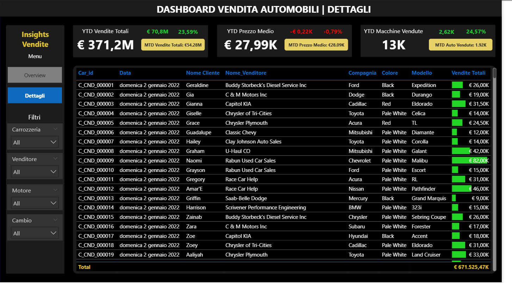

# 🚗 Dashboard Vendita Automobili - Power BI

Dashboard interattiva per l'analisi delle vendite di automobili, sviluppata con Power BI. Il progetto include due pagine principali: una vista **Overview** con KPI e metriche aggregate, e una vista **Dettagli** con i dati granulari delle transazioni.




## 📊 Caratteristiche Principali

### Overview Dashboard
- **KPI Principali**: Vendite YTD/MTD, Prezzo Medio, Automobili Vendute
- **Metriche Comparative**: Crescita YoY e confronto con anno precedente (PYTD)
- **Visualizzazioni**:
  - Trend vendite settimanali con evidenziazione picco massimo
  - Distribuzione vendite per carrozzeria e colore (donut charts)
  - Mappa geografica vendite per regione
  - Tabella performance per azienda con barre di crescita

### Dettagli Dashboard
- Tabella dettagliata con tutte le transazioni
- Filtri dinamici per Carrozzeria, Venditore, Motore e Cambio
- Navigazione fluida tra le due pagine

## 🛠️ Tecnologie e Competenze

- **Power BI Desktop**: Creazione dashboard e visualizzazioni
- **DAX**: Formule per calcoli time intelligence (YTD, MTD, PYTD, YoY)
- **Power Query**: Data cleaning e trasformazione dati
- **Data Modeling**: Creazione tabella calendario e relazioni

## 📈 Metriche Implementate

### Formule DAX Principali - Tutte le Formule usate sono disponibili nel Documento presente nella REPO
```dax
YTD Vendite Totali = TOTALYTD(SUM(car_data[Prezzo (€)]), calendario[Date])

PYTD Vendite Totali = CALCULATE([YTD Vendite Totali], SAMEPERIODLASTYEAR(calendario[Date]))

YoY Crescita = [Differenza Vendite] / [PYTD Vendite Totali]

Prezzo Medio = SUM(car_data[Prezzo (€)]) / COUNT(car_data[Car_id])

Picco Massimo = VAR MaxVendite = MAXX(ALLSELECTED(calendario[Settimana]), [Vendite Totali])
                RETURN IF([Vendite Totali] = MaxVendite, MaxVendite, BLANK())
```

## 🎨 Design

- Background personalizzato creato con PowerPoint
- Formattazione condizionale per indicatori di crescita (verde/rosso)
- Card con bordi arrotondati e valori formattati (M/K)
- Tema scuro professionale per migliore leggibilità

### Impostazione Background
I file di background per entrambe le pagine sono inclusi nella repository:
- `background_overview.png` - Per la pagina Overview
- `background_dettagli.png` - Per la pagina Dettagli

**Procedimento per impostare il background:**
1. In Power BI Desktop, seleziona la pagina desiderata
2. Nel pannello **Visualizzazioni**, clicca su **Formato pagina** (icona rullo di pittura)
3. Espandi la sezione **Canvas background** (Sfondo canvas)
4. Clicca su **Immagine** → **Sfoglia**
5. Seleziona il file background corrispondente dalla repository
6. Imposta **Trasparenza** a **0%**
7. Imposta **Adatta alle dimensioni** su **Normale** o **Adatta**
8. Imposta **Allineamento immagine** su **Center** (Centro) o **Middle** per centrarlo verticalmente
9. Ripeti il procedimento per l'altra pagina

## 📂 Struttura Progetto
```
├── car_data.xlsx              # Dataset vendite automobili
├── Car_Sales.pbix             # File Power BI
├── Background/                # File background per le pagine
│   ├── background_overview.png
│   └── background_dettagli.png
├── Formule_DAX.md             # Documentazione completa formule DAX
├── Screenshots/               # Screenshot delle dashboard
│   ├── Overview.png
│   └── Dettagli.png
└── README.md
```

## 🚀 Come Utilizzare

1. Aprire il file `.pbix` con Power BI Desktop
2. Verificare il percorso del file dati `car_data.xlsx`
3. Aggiornare i dati se necessario
4. (Opzionale) Reimpostare i background delle pagine seguendo la procedura sopra
5. Utilizzare i filtri nel pannello laterale per esplorare i dati
6. Navigare tra Overview e Dettagli tramite i pulsanti in alto

## 📊 Dataset

Il dataset include informazioni su:
- **ID Transazione** e **Data vendita**
- **Cliente** e **Venditore**
- **Caratteristiche auto**: Compagnia, Modello, Colore, Carrozzeria, Motore, Cambio
- **Prezzo di vendita**
